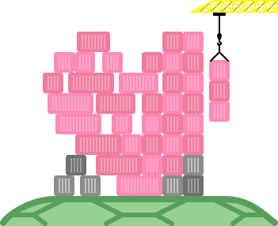

<!-- markdownlint-disable MD033 -->

# neurontainer

`neurontainer` (pronounced neuron-tainer, all lowercase) is a Neuro integration that allows Neuro to communicate and control the Docker daemon, via the Docker Engine API.

> **INSERT BIG WARNING HERE**
>
> You probably shouldn't open the control panel while screensharing, if your Neuro server is not ran on `localhost` (or `host.docker.internal` in our case).

## Usage

Docker Desktop must be downloaded and installed from [the official Docker website](https://www.docker.com/).

You can then choose one of two ways to install the extension.

Extension Hub

Once installed, go to the Extensions > Manage tab, click `Browse`, and search for `neurontainer`.

> [!WARNING]
> The initial version is not going to appear for a little bit as there is a small submissions process.
> If you don't see this extension after restarting Docker Desktop, follow the Manual installation steps instead.

Manual installation

As `neurontainer` is just a Docker image, you can also install them manually. You will need the Docker CLI to do so.
You can obtain `neurontainer` images from these locations:

- KTrain5369's Docker Hub repository (`ktrain5369/neurontainer`)
- VSC-NeuroPilot's GitHub Container Registry (`ghcr.io/VSC-NeuroPilot/neurontainer`)

You'll need to do the following to install it this way:

- In Docker Desktop settings, go to Extension -> uncheck "Only allow extensions distributed through the Docker Marketplace".
- In the terminal, run `docker pull <container>` to pull the latest `neurontainer` image.

    `<container>` refers to the repository location, stated above in codeblocks.

    So if you want to pull from Docker Hub, replace `<container>` with `ktrain5369/neurontainer`.
    If you want to pull from GHCR, replace `<container>` with `ghcr.io/VSC-NeuroPilot/neurontainer`.

    You can also search for the container on Docker Hub via the dashboard tab with the same name.

- After a successful pull, run `docker extension install neurontainer:latest` to install it as an extension.
- Every update, you'll need to pull from your chosen source again and run `docker extension update neurontainer:latest`.

### Headless environments

An executable binary is planned for headless or otherwise non-Docker Desktop environments, but is currently unreleased.

## Neuro server connection

- The backend server/VM is connected to `ws://host.docker.internal:8000` (which is mapped to `localhost:8000`).
- Use the dashboard UI in Docker Desktop to configure the connected server if your Neuro server is elsewhere.

## Feature-completeness

Due to the incompleteness of the Docker TypeScript SDK, there are some missing features in the SDK that exist in the Docker Engine API.
While it is possible to implement directly via HTTP APIs or a community SDK, using the official SDK reliably ensures that we have to handle less things.

Implementation of missing features will be considered on a case-by-case basis. You can see currently planned features in the [to-do list](./TODO.md).

## Other info

- This extension uses the [TypeScript Neuro Game SDK by AriesAlex](https://github.com/AriesAlex/typescrit-neuro-game-sdk).
- Icon by [Pasu4](https://github.com/Pasu4).
- Documentation coming soon!

- `neurontainer` is part of VSC-NeuroPilot. You can learn more about us [on our GitHub page](https://github.com/VSC-NeuroPilot).
- This project is licensed under the MIT license.
- You can find a list of planned features in our to-do Markdown file on the GitHub repo.
- The image includes the `package.json` files for the frontend, backend and main root, as well as the pnpm lockfile. You can use this to inspect the dependency tree of the tools we use.
